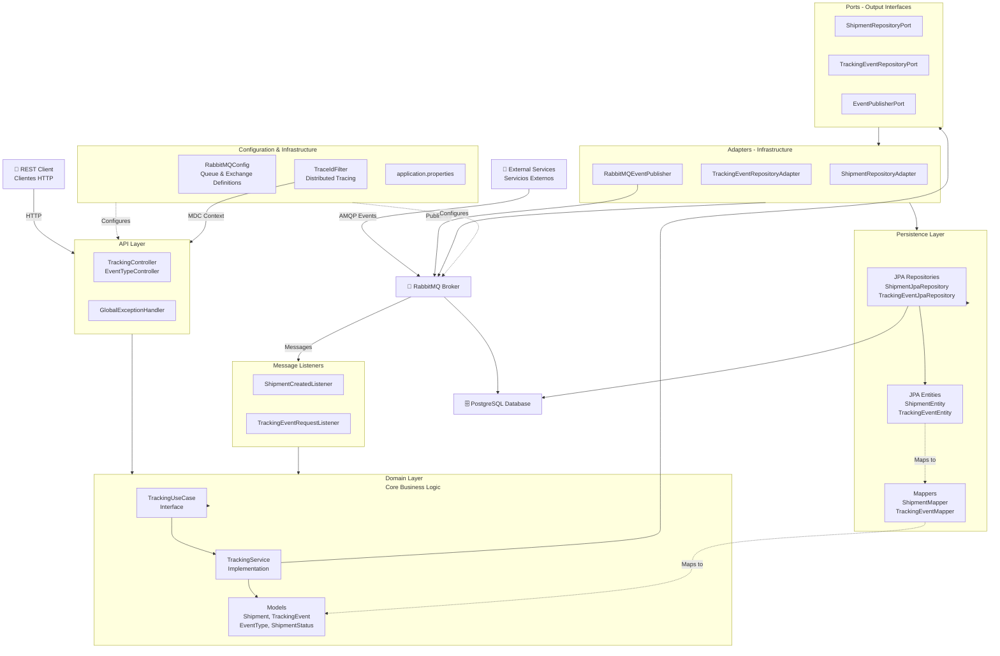
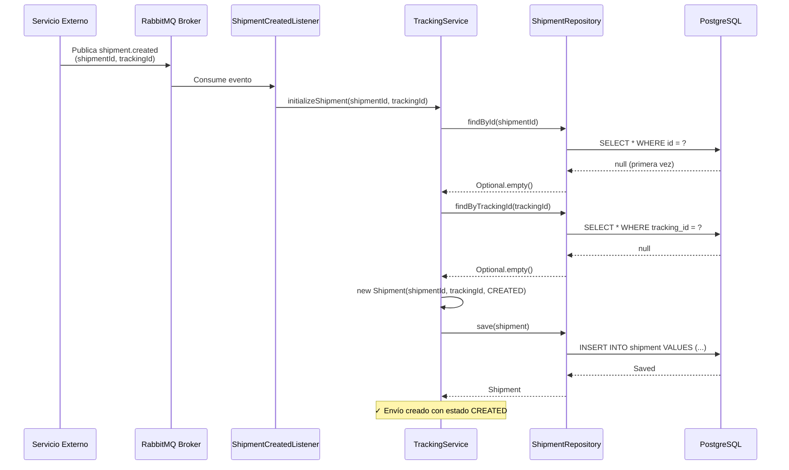
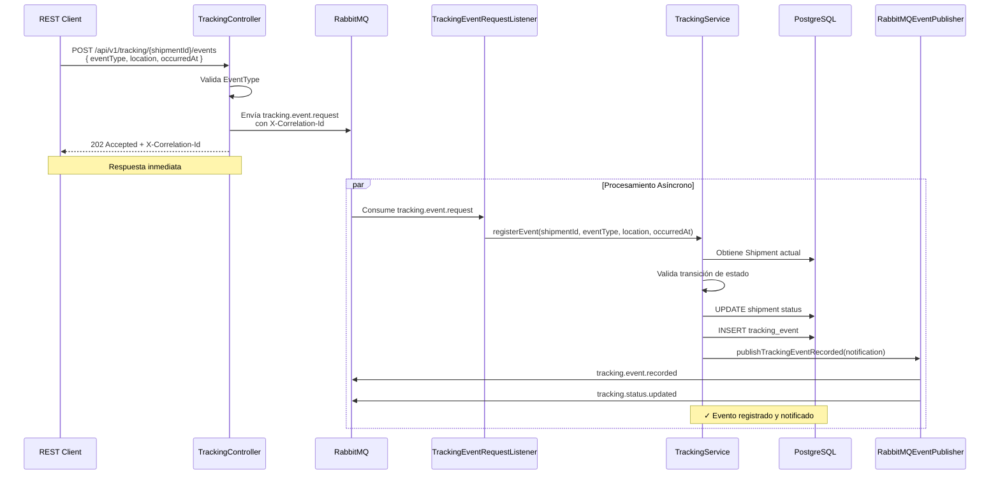
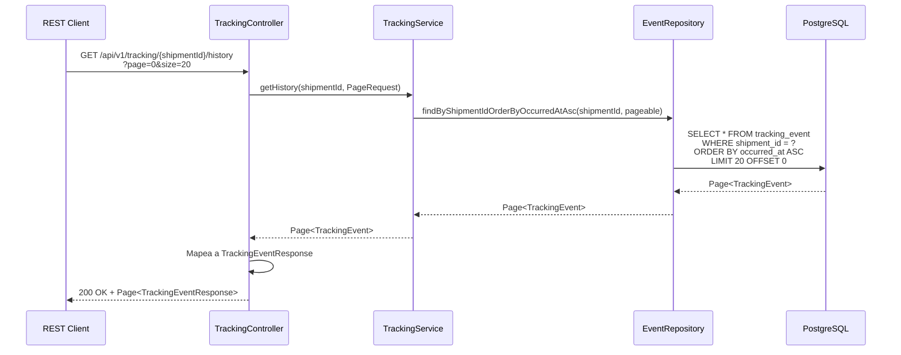

# Tracking Service - Sistema de Seguimiento Logístico

## 📋 Tabla de Contenidos

- [Descripción General](#descripción-general)
- [Características Principales](#características-principales)
- [Stack Tecnológico](#stack-tecnológico)
- [Arquitectura](#arquitectura)
- [Diagrama de Componentes](#diagrama-de-componentes)
- [Flujos de Negocio](#flujos-de-negocio)
- [Estructura del Proyecto](#estructura-del-proyecto)
- [Modelos de Dominio](#modelos-de-dominio)
- [API REST](#api-rest)
- [Configuración](#configuración)
- [Setup y Ejecución](#setup-y-ejecución)
- [Testing](#testing)
- [Deployment](#deployment)
- [Observabilidad](#observabilidad)
- [Contribución](#contribución)

---

## 🎯 Descripción General

**Tracking Service** es un microservicio backend responsable del **seguimiento logístico de envíos**. Gestiona eventos de rastreo, actualiza estados de paquetes y expone APIs REST para consultar el progreso en tiempo real.

Diseñado como un microservicio **independiente y altamente escalable** con arquitectura hexagonal, comunicación asíncrona vía RabbitMQ y persistencia en PostgreSQL.

**Casos de uso:**
- Registrar creación de envíos
- Procesar eventos de seguimiento (despacho, llegada a hub, entrega, etc.)
- Consultar historial de eventos de un envío
- Publicar notificaciones de cambios de estado
- Manejar excepciones y envíos dañados

---

## ✨ Características Principales

| Característica | Descripción |
|---|---|
| **Arquitectura Hexagonal** | Separación clara entre dominio, aplicación e infraestructura |
| **Idempotencia** | Manejo robusto de duplicados en eventos de creación |
| **Transaccionalidad** | Operaciones ACID garantizadas en base de datos |
| **Mensajería Asíncrona** | RabbitMQ con Dead Letter Queue para reintentos |
| **Paginación** | Historial de eventos con soporte para navegación |
| **Type-Safe** | Enums para tipos de eventos y estados |
| **Tracing Distribuido** | MDC (Mapped Diagnostic Context) para correlacionar logs |
| **OpenAPI 3.0** | Documentación interactiva de API (Swagger) |
| **Cobertura de Pruebas** | >40% de cobertura con JaCoCo |
| **Docker Multi-stage** | Optimización de tamaño de imagen |

---

## 🛠 Stack Tecnológico

```
┌─ Backend Framework
├─ Spring Boot 4.0.6
├─ Spring Data JPA
├─ Spring AMQP (RabbitMQ)
├─ Spring Web (REST)
│
├─ Database & Migrations
├─ PostgreSQL 15+
├─ Flyway 10.0.0
├─ Lombok (Boilerplate reduction)
│
├─ Messaging
├─ RabbitMQ (AMQP)
│
├─ Documentation & API
├─ SpringDoc OpenAPI 3.0.2
├─ Swagger UI
│
├─ Testing
├─ JUnit 5
├─ Mockito 5.23.0
├─ Karate 1.5.1 (BDD)
├─ Spring Boot Test
├─ H2 Database (test)
│
├─ Quality & Observability
├─ JaCoCo (Code Coverage)
├─ SonarCloud (Code Analysis)
│
└─ Deployment
  ├─ Docker (Multi-stage)
  └─ Java 21 LTS
```

---

## 🏗 Arquitectura

### Visión de Alto Nivel



---

## 📊 Diagrama de Componentes y Clases

```mermaid
classDiagram
    %% Domain Models
    class Shipment {
        -UUID id
        -String trackingId
        -ShipmentStatus status
        -LocalDateTime createdAt
        -LocalDateTime updatedAt
        +updateStatus(ShipmentStatus)
        +getId()
        +getTrackingId()
        +getStatus()
    }
    
    class ShipmentStatus {
        <<enumeration>>
        CREATED
        IN_TRANSIT
        AT_TRANSIT_POINT
        OUT_FOR_DELIVERY
        DELIVERED
        EXCEPTION
        +canTransitionTo(ShipmentStatus) boolean
    }
    
    class TrackingEvent {
        -UUID id
        -UUID shipmentId
        -EventType eventType
        -ShipmentStatus statusBefore
        -ShipmentStatus statusAfter
        -String location
        -LocalDateTime occurredAt
        -LocalDateTime createdAt
    }
    
    class EventType {
        <<enumeration>>
        DISPATCHED
        ARRIVED_AT_HUB
        DEPARTED_FROM_HUB
        ARRIVED_AT_TERMINAL
        DEPARTED_FROM_TERMINAL
        OUT_FOR_DELIVERY
        DELIVERED
        DAMAGED
        -ShipmentStatus targetStatus
        +getTargetStatus()
    }
    
    class TrackingEventNotification {
        <<record>>
        UUID shipmentId
        String trackingId
        String eventType
        String previousStatus
        String newStatus
        LocalDateTime occurredAt
    }
    
    %% Use Cases & Services
    class TrackingUseCase {
        <<interface>>
        +initializeShipment(UUID, String)
        +registerEvent(UUID, EventType, String, LocalDateTime)*
        +registerEvent(UUID, String, String, LocalDateTime)*
        +getHistory(UUID, Pageable) Page~TrackingEvent~
        +getCurrentStatus(UUID) Shipment
    }
    
    class TrackingService {
        -ShipmentRepositoryPort shipmentRepository
        -TrackingEventRepositoryPort eventRepository
        -EventPublisherPort eventPublisher
        +initializeShipment(UUID, String)
        +registerEvent(UUID, EventType, String, LocalDateTime) TrackingEvent
        +registerEventInternal(UUID, EventType, String, LocalDateTime) TrackingEvent
        +getHistory(UUID, Pageable) Page~TrackingEvent~
        +getCurrentStatus(UUID) Shipment
    }
    
    %% Output Ports
    class ShipmentRepositoryPort {
        <<interface>>
        +save(Shipment) Shipment
        +findById(UUID) Optional~Shipment~
        +findByTrackingId(String) Optional~Shipment~
    }
    
    class TrackingEventRepositoryPort {
        <<interface>>
        +save(TrackingEvent) TrackingEvent
        +findByShipmentIdOrderByOccurredAtAsc(UUID, Pageable) Page~TrackingEvent~
    }
    
    class EventPublisherPort {
        <<interface>>
        +publishTrackingEventRecorded(TrackingEventNotification)
    }
    
    %% Adapters
    class ShipmentRepositoryAdapter {
        -ShipmentJpaRepository jpaRepository
        -ShipmentMapper mapper
        +save(Shipment) Shipment
        +findById(UUID) Optional~Shipment~
        +findByTrackingId(String) Optional~Shipment~
    }
    
    class TrackingEventRepositoryAdapter {
        -TrackingEventJpaRepository jpaRepository
        -TrackingEventMapper mapper
        +save(TrackingEvent) TrackingEvent
        +findByShipmentIdOrderByOccurredAtAsc(UUID, Pageable) Page
    }
    
    class RabbitMQEventPublisher {
        -RabbitTemplate rabbitTemplate
        +publishTrackingEventRecorded(TrackingEventNotification)
    }
    
    %% Mappers
    class ShipmentMapper {
        +toEntity(Shipment) ShipmentEntity
        +toDomain(ShipmentEntity) Shipment
    }
    
    class TrackingEventMapper {
        +toEntity(TrackingEvent) TrackingEventEntity
        +toDomain(TrackingEventEntity) TrackingEvent
    }
    
    %% JPA Repositories
    class ShipmentJpaRepository {
        <<interface>>
        +findByTrackingId(String) Optional~ShipmentEntity~
    }
    
    class TrackingEventJpaRepository {
        <<interface>>
        +findByShipmentId(UUID, Pageable) Page~TrackingEventEntity~
    }
    
    %% JPA Entities
    class ShipmentEntity {
        -UUID id
        -String trackingId
        -String status
        -LocalDateTime createdAt
        -LocalDateTime updatedAt
    }
    
    class TrackingEventEntity {
        -UUID id
        -UUID shipmentId
        -EventType eventType
        -String statusBefore
        -String statusAfter
        -String location
        -LocalDateTime occurredAt
        -LocalDateTime createdAt
    }
    
    %% REST Controllers
    class TrackingController {
        -TrackingUseCase trackingUseCase
        -RabbitTemplate rabbitTemplate
        +registerEvent(UUID, RegisterEventRequest) ResponseEntity~Void~
        +getHistory(UUID, int, int) ResponseEntity~Page~TrackingEventResponse~~
    }
    
    class EventTypeController {
        +getEventTypes() List~Map~String, String~~
    }
    
    %% Message Listeners
    class ShipmentCreatedListener {
        -TrackingUseCase trackingUseCase
        +handleShipmentCreated(ShipmentCreatedEvent)
    }
    
    class TrackingEventRequestListener {
        -TrackingUseCase trackingUseCase
        +handleTrackingEventRequest(TrackingEventRequest)
    }
    
    %% Exception Handler
    class GlobalExceptionHandler {
        +handleShipmentNotFound(ShipmentNotFoundException) ResponseEntity
        +handleIllegalState(IllegalStateException) ResponseEntity
        +handleValidationExceptions(MethodArgumentNotValidException) ResponseEntity
        +handleIllegalArgument(IllegalArgumentException) ResponseEntity
    }
    
    %% Configuration
    class RabbitMQConfig {
        +shipmentCreatedQueue() Queue
        +trackingEventRecordedQueue() Queue
        +logisticsExchange() TopicExchange
        +shipmentCreatedBinding() Binding
        +trackingEventRecordedBinding() Binding
        +trackingEventRequestQueue() Queue
        +trackingEventRequestDeadLetterExchange() TopicExchange
        +messageConverter() MessageConverter
    }
    
    %% Relationships
    Shipment o-- ShipmentStatus
    TrackingEvent o-- EventType
    TrackingEvent o-- ShipmentStatus
    TrackingEventNotification o-- EventType
    
    TrackingService ..|> TrackingUseCase
    TrackingService --> ShipmentRepositoryPort
    TrackingService --> TrackingEventRepositoryPort
    TrackingService --> EventPublisherPort
    
    ShipmentRepositoryAdapter ..|> ShipmentRepositoryPort
    ShipmentRepositoryAdapter --> ShipmentJpaRepository
    ShipmentRepositoryAdapter --> ShipmentMapper
    
    TrackingEventRepositoryAdapter ..|> TrackingEventRepositoryPort
    TrackingEventRepositoryAdapter --> TrackingEventJpaRepository
    TrackingEventRepositoryAdapter --> TrackingEventMapper
    
    RabbitMQEventPublisher ..|> EventPublisherPort
    
    ShipmentMapper --> ShipmentEntity
    TrackingEventMapper --> TrackingEventEntity
    
    TrackingController --> TrackingUseCase
    TrackingController --> RabbitMQConfig
    
    ShipmentCreatedListener --> TrackingUseCase
    TrackingEventRequestListener --> TrackingUseCase
```



---

## 🔄 Flujos de Negocio

### Flujo 1: Crear Envío



### Flujo 2: Registrar Evento de Tracking



### Flujo 3: Consultar Historial



---

## 📂 Estructura del Proyecto

```
src/main/
├── java/com/github/camiloperez77/trackingservice/
│   ├── TrackingServiceApplication.java              # Entry point
│   │
│   ├── application/                                  # Application Layer
│   │   ├── listeners/
│   │   │   ├── ShipmentCreatedListener.java
│   │   │   └── TrackingEventRequestListener.java
│   │   └── rest/
│   │       ├── TrackingController.java              # REST API endpoints
│   │       ├── EventTypeController.java             # Event types catalog
│   │       └── GlobalExceptionHandler.java          # Centralized error handling
│   │
│   ├── domain/                                       # Domain Layer
│   │   ├── exception/
│   │   │   └── ShipmentNotFoundException.java
│   │   ├── model/
│   │   │   ├── EventType.java                       # Enum de tipos de eventos
│   │   │   ├── Shipment.java                        # Agregado principal
│   │   │   ├── ShipmentStatus.java                  # Enum de estados
│   │   │   ├── TrackingEvent.java                   # Modelo de evento
│   │   │   └── TrackingEventNotification.java       # DTO de notificación
│   │   ├── ports/
│   │   │   ├── in/
│   │   │   │   └── TrackingUseCase.java             # Input port (casos de uso)
│   │   │   └── out/
│   │   │       ├── ShipmentRepositoryPort.java
│   │   │       ├── TrackingEventRepositoryPort.java
│   │   │       └── EventPublisherPort.java
│   │   └── service/
│   │       └── TrackingService.java                 # Implementación de casos de uso
│   │
│   └── infrastructure/                               # Infrastructure Layer
│       ├── config/
│       │   └── TraceIdFilter.java                   # Distributed tracing (MDC)
│       ├── messaging/
│       │   ├── config/
│       │   │   └── RabbitMQConfig.java              # Queue & Exchange definitions
│       │   ├── dto/
│       │   │   ├── ShipmentCreatedEvent.java
│       │   │   ├── TrackingEventRequest.java
│       │   │   └── TrackingEventRecordedEvent.java
│       │   └── publisher/
│       │       └── RabbitMQEventPublisher.java      # Output adapter for events
│       └── persistence/
│           ├── adapter/
│           │   ├── ShipmentRepositoryAdapter.java
│           │   └── TrackingEventRepositoryAdapter.java
│           ├── entity/
│           │   ├── ShipmentEntity.java
│           │   └── TrackingEventEntity.java
│           ├── mapper/
│           │   ├── ShipmentMapper.java
│           │   └── TrackingEventMapper.java
│           └── repository/
│               ├── ShipmentJpaRepository.java
│               └── TrackingEventJpaRepository.java
│
└── resources/
    ├── application.properties
    ├── application-prod.properties
    ├── db/
    │   └── migration/
    │       └── V1__init.sql                         # Flyway migration
```

---

## 🎯 Modelos de Dominio

### Shipment

El agregado raíz que representa un envío en el sistema.

```java
@Getter
public class Shipment {
    private UUID id;                    // Identificador único
    private String trackingId;          // Identificador visible del envío
    private ShipmentStatus status;      // Estado actual del envío
    private LocalDateTime createdAt;    // Timestamp de creación
    private LocalDateTime updatedAt;    // Timestamp de última actualización
    
    public void updateStatus(ShipmentStatus newStatus) {
        if (!this.status.canTransitionTo(newStatus)) {
            throw new IllegalStateException(...);
        }
        this.status = newStatus;
        this.updatedAt = LocalDateTime.now();
    }
}
```

**Características:**
- Validación de transiciones de estado
- Timestamps automáticos
- Identificadores únicos (id y trackingId)

---

### ShipmentStatus

Enum que define los estados posibles de un envío.

```
CREATED (inicial)
    ↓
IN_TRANSIT ←→ AT_TRANSIT_POINT
    ↓
OUT_FOR_DELIVERY
    ↓
DELIVERED (terminal)

EXCEPTION (desde cualquier estado intermedio)
```

**Transiciones válidas:**
- `CREATED` → `IN_TRANSIT`, `AT_TRANSIT_POINT`
- `IN_TRANSIT` ↔ `AT_TRANSIT_POINT`, → `OUT_FOR_DELIVERY`, `EXCEPTION`
- `AT_TRANSIT_POINT` → `IN_TRANSIT`, `OUT_FOR_DELIVERY`, `EXCEPTION`
- `OUT_FOR_DELIVERY` → `DELIVERED`, `EXCEPTION`
- `DELIVERED` → (terminal, sin transiciones)
- `EXCEPTION` → `CREATED`, `IN_TRANSIT`, `AT_TRANSIT_POINT` (recuperación)

---

### EventType

Enum que mapea eventos de rastreo a cambios de estado.

| EventType | Target Status | Descripción |
|-----------|---------------|-------------|
| `DISPATCHED` | `IN_TRANSIT` | Envío despachado del almacén |
| `ARRIVED_AT_HUB` | `AT_TRANSIT_POINT` | Llegó a centro de distribución |
| `DEPARTED_FROM_HUB` | `IN_TRANSIT` | Salió del centro de distribución |
| `ARRIVED_AT_TERMINAL` | `AT_TRANSIT_POINT` | Llegó a terminal de entrega |
| `DEPARTED_FROM_TERMINAL` | `IN_TRANSIT` | Salió de terminal de entrega |
| `OUT_FOR_DELIVERY` | `OUT_FOR_DELIVERY` | Salió para entrega final |
| `DELIVERED` | `DELIVERED` | Entregado al destinatario |
| `DAMAGED` | `EXCEPTION` | Envío dañado |

---

### TrackingEvent

Modelo que registra cada evento de seguimiento.

```java
@Builder
@Getter
@AllArgsConstructor
public class TrackingEvent {
    private UUID id;
    private UUID shipmentId;
    private EventType eventType;
    private ShipmentStatus statusBefore;
    private ShipmentStatus statusAfter;
    private String location;
    private LocalDateTime occurredAt;
    private LocalDateTime createdAt;
}
```

**Propósito:** Mantener un historial auditable de todos los cambios de estado.

---

## 📡 API REST

### Base URL
```
/api/v1/tracking
```

### Endpoints

#### 1. Registrar Evento de Tracking

```http
POST /api/v1/tracking/{shipmentId}/events
Content-Type: application/json
X-Correlation-Id: optional-uuid

{
    "eventType": "DISPATCHED",
    "location": "Hub Central - Bogotá",
    "occurredAt": "2026-05-14T10:30:00"
}
```

**Respuesta:**
```http
202 Accepted
X-Correlation-Id: 550e8400-e29b-41d4-a716-446655440000
```

**Códigos de estado:**
- `202 Accepted` - Evento aceptado para procesamiento asíncrono
- `400 Bad Request` - Validación fallida
- `404 Not Found` - Shipment no encontrado
- `409 Conflict` - Transición de estado inválida

---

#### 2. Obtener Historial de Eventos

```http
GET /api/v1/tracking/{shipmentId}/history?page=0&size=20&sort=occurredAt,asc
```

**Respuesta:**
```http
200 OK
Content-Type: application/json

{
    "content": [
        {
            "id": "550e8400-e29b-41d4-a716-446655440001",
            "eventType": "DISPATCHED",
            "statusBefore": "CREATED",
            "statusAfter": "IN_TRANSIT",
            "location": "Hub Central",
            "occurredAt": "2026-05-14T09:00:00",
            "createdAt": "2026-05-14T09:05:00"
        },
        ...
    ],
    "pageable": {
        "pageNumber": 0,
        "pageSize": 20,
        "totalElements": 5,
        "totalPages": 1
    }
}
```

---

#### 3. Obtener Estado Actual

```http
GET /api/v1/tracking/{shipmentId}/current
```

**Respuesta:**
```http
200 OK
Content-Type: application/json

{
    "id": "550e8400-e29b-41d4-a716-446655440000",
    "trackingId": "TRK-20260514-001",
    "status": "IN_TRANSIT",
    "createdAt": "2026-05-14T08:00:00",
    "updatedAt": "2026-05-14T09:05:00"
}
```

---

#### 4. Catálogo de Tipos de Eventos

```http
GET /api/v1/tracking/eventTypes
```

**Respuesta:**
```http
200 OK
Content-Type: application/json

[
    {
        "name": "DISPATCHED",
        "targetStatus": "IN_TRANSIT"
    },
    {
        "name": "ARRIVED_AT_HUB",
        "targetStatus": "AT_TRANSIT_POINT"
    },
    ...
]
```

---

## ⚙️ Configuración

### application.properties (Producción)

```properties
# Application
spring.application.name=tracking-service
spring.profiles.active=prod

# Server
server.port=${PORT:8080}

# Database
spring.datasource.url=${SPRING_DATASOURCE_URL}
spring.datasource.username=${SPRING_DATASOURCE_USERNAME}
spring.datasource.password=${SPRING_DATASOURCE_PASSWORD}
spring.datasource.driver-class-name=org.postgresql.Driver

# JPA/Hibernate
spring.jpa.hibernate.ddl-auto=validate
spring.jpa.properties.hibernate.dialect=org.hibernate.dialect.PostgreSQLDialect
spring.jpa.show-sql=false
spring.jpa.properties.hibernate.format_sql=true

# Flyway Database Migrations
spring.flyway.enabled=true
spring.flyway.baseline-on-migrate=true
spring.flyway.baseline-version=1
spring.flyway.locations=classpath:db/migration

# RabbitMQ
spring.rabbitmq.host=${SPRING_RABBITMQ_HOST}
spring.rabbitmq.port=${SPRING_RABBITMQ_PORT:5672}
spring.rabbitmq.username=${SPRING_RABBITMQ_USERNAME}
spring.rabbitmq.password=${SPRING_RABBITMQ_PASSWORD}
spring.rabbitmq.virtual-host=${SPRING_RABBITMQ_VHOST:/}
spring.rabbitmq.ssl.enabled=${SPRING_RABBITMQ_SSL_ENABLED:false}
spring.rabbitmq.listener.simple.default-requeue-rejected=false

# Logging
logging.level.root=INFO
logging.pattern.console=%d{yyyy-MM-dd HH:mm:ss.SSS} [%thread] %-5level %logger{36} - [%mdc{traceId}] - %msg%n

# SpringDoc OpenAPI (Swagger)
springdoc.swagger-ui.path=/swagger-ui.html
springdoc.api-docs.path=/v3/api-docs
springdoc.packages-to-scan=com.github.camiloperez77.trackingservice.application.rest
```

### application-test.properties (Testing)

```properties
# Database (H2 in-memory)
spring.datasource.url=jdbc:h2:mem:testdb;DB_CLOSE_DELAY=-1;MODE=PostgreSQL
spring.datasource.driver-class-name=org.h2.Driver
spring.datasource.username=sa
spring.datasource.password=

# JPA
spring.jpa.hibernate.ddl-auto=create-drop

# Flyway
spring.flyway.enabled=false

# RabbitMQ (disabled for tests)
spring.rabbitmq.listener.simple.auto-startup=false
```

---

## 🚀 Setup y Ejecución

### Requisitos Previos

- Java 21 LTS
- Maven 3.9+
- PostgreSQL 15+
- RabbitMQ 3.12+
- Docker (opcional, para contenedores)

### Instalación Local

#### 1. Clonar el repositorio
```bash
git clone https://github.com/camiloperez77/tracking-service.git
cd tracking-service
```

#### 2. Configurar variables de entorno
```bash
export SPRING_DATASOURCE_URL=jdbc:postgresql://localhost:5432/tracking_db
export SPRING_DATASOURCE_USERNAME=postgres
export SPRING_DATASOURCE_PASSWORD=postgres
export SPRING_RABBITMQ_HOST=localhost
export SPRING_RABBITMQ_PORT=5672
export SPRING_RABBITMQ_USERNAME=guest
export SPRING_RABBITMQ_PASSWORD=guest
```

#### 3. Crear base de datos
```bash
createdb -U postgres tracking_db
```

#### 4. Compilar el proyecto
```bash
mvn clean compile
```

#### 5. Ejecutar la aplicación
```bash
mvn spring-boot:run
```
## Documentación Swagger

` https://tracking-hq1g.onrender.com/swagger-ui/index.html `

---

### Ejecución con Docker Compose

```yaml
version: '3.8'

services:
  postgres:
    image: postgres:15-alpine
    container_name: tracking-postgres
    environment:
      POSTGRES_DB: tracking_db
      POSTGRES_USER: postgres
      POSTGRES_PASSWORD: postgres
    ports:
      - "5432:5432"
    volumes:
      - postgres_data:/var/lib/postgresql/data

  rabbitmq:
    image: rabbitmq:3.12-management-alpine
    container_name: tracking-rabbitmq
    environment:
      RABBITMQ_DEFAULT_USER: guest
      RABBITMQ_DEFAULT_PASS: guest
    ports:
      - "5672:5672"
      - "15672:15672"
    healthcheck:
      test: rabbitmq-diagnostics -q ping
      interval: 30s
      timeout: 10s
      retries: 5

  tracking-service:
    build:
      context: .
      dockerfile: Dockerfile
    container_name: tracking-service
    depends_on:
      postgres:
        condition: service_started
      rabbitmq:
        condition: service_healthy
    environment:
      SPRING_DATASOURCE_URL: jdbc:postgresql://postgres:5432/tracking_db
      SPRING_DATASOURCE_USERNAME: postgres
      SPRING_DATASOURCE_PASSWORD: postgres
      SPRING_RABBITMQ_HOST: rabbitmq
      SPRING_RABBITMQ_PORT: 5672
      SPRING_RABBITMQ_USERNAME: guest
      SPRING_RABBITMQ_PASSWORD: guest
    ports:
      - "8080:8080"
    healthcheck:
      test: ["CMD", "curl", "-f", "http://localhost:8080/actuator/health"]
      interval: 30s
      timeout: 10s
      retries: 3

volumes:
  postgres_data:
```

**Ejecutar:**
```bash
docker-compose up -d
```

---

## 🧪 Testing

### Ejecutar todas las pruebas
```bash
mvn test
```

### Ejecutar pruebas específicas
```bash
# Solo unit tests
mvn test -Dtest=*Test

# Solo integration tests
mvn test -Dtest=*ApplicationTest

# Solo E2E tests (Karate)
mvn test -Dtest=*KarateTest
```

### Cobertura de código
```bash
mvn clean test jacoco:report
# Reporte en: target/site/jacoco/index.html
```

### Pruebas incluidas

| Clase de Test | Casos Cubiertos |
|---|---|
| `TrackingServiceTest` | Registro de eventos, transiciones, búsqueda de historial |
| `TrackingServiceApplicationTest` | Transiciones válidas/inválidas, idempotencia |
| `TrackingServiceApplicationIdempotencyTest` | Manejo de duplicados en creación de envíos |
| `ShipmentCreatedListenerTest` | Listeners de RabbitMQ, parsing de eventos |
| `TrackingEventRequestListenerTest` | Procesamiento asíncrono de eventos |
| `TrackingControllerTest` | Endpoints REST, status codes, headers |
| `GlobalExceptionHandlerTest` | Manejo de excepciones |
| `ShipmentTest`, `EventTypeTest`, `ShipmentStatusTest` | Validaciones de modelos |
| `TrackingKarateTest` | E2E BDD scenarios |

**Cobertura mínima:** 40% (JaCoCo)

---

## 🐳 Deployment

### Build Docker Image

```bash
docker build -t tracking-service:latest .
```

### Dockerfile Multi-stage

```dockerfile
# Stage 1: Build
FROM maven:3.9-eclipse-temurin-21 AS builder
WORKDIR /app
COPY pom.xml .
RUN mvn dependency:go-offline -B
COPY src ./src
RUN mvn clean package -DskipTests -B

# Stage 2: Runtime
FROM eclipse-temurin:21-jre-noble
WORKDIR /app
COPY --from=builder /app/target/*.jar app.jar

# Security: non-root user
RUN useradd -m appuser && chown -R appuser:appuser /app
USER appuser

# Health check
HEALTHCHECK --interval=30s --timeout=10s --start-period=40s --retries=3 \
    CMD java -jar app.jar --health-check || exit 1

EXPOSE 8080
ENTRYPOINT ["java", "-jar", "app.jar"]
```

**Ventajas:**
- Tamaño optimizado: solo runtime necesario
- Security: usuario no-root
- Health checks integrados

---

## 📊 Observabilidad

### Structured Logging

Todos los logs incluyen `traceId` para correlacionar solicitudes distribuidas:

```
2026-05-14 10:30:45.123 [main] INFO  TrackingService - [550e8400-e29b-41d4] - Registering event - shipmentId: abc123, eventType: DISPATCHED
```

### Trace ID Filter

El `TraceIdFilter` inyecta automáticamente un `traceId` en el MDC (Mapped Diagnostic Context):

```java
@Component
public class TraceIdFilter extends OncePerRequestFilter {
    @Override
    protected void doFilterInternal(HttpServletRequest request, ...) {
        String traceId = request.getHeader("traceId");
        if (traceId == null) {
            traceId = UUID.randomUUID().toString();
        }
        MDC.put("traceId", traceId);
        // ...
    }
}
```

### Integración con SonarCloud

El proyecto está configurado para enviar métricas de calidad a SonarCloud:

```bash
mvn clean verify sonar:sonar \
  -Dsonar.projectKey=tracking-service \
  -Dsonar.organization=your-org \
  -Dsonar.host.url=https://sonarcloud.io \
  -Dsonar.login=${SONAR_TOKEN}
```

---

## 🔗 Integración con RabbitMQ

### Colas y Exchanges

```
┌─ logistics.exchange (TopicExchange)
│
├─ shipment.created (routing key)
│  └─ tracking.shipment.created.queue
│
├─ tracking.event.request (routing key)
│  └─ tracking.event.request.queue
│     └─ DLX: tracking.event.request.dlx
│        └─ DLQ: tracking.event.request.dlq
│
├─ tracking.event.recorded (routing key)
│  └─ tracking.event.recorded.queue
│
└─ tracking.status.updated (routing key)
   └─ (consumed by other services)
```

### DTOs de Mensajería

**ShipmentCreatedEvent:**
```java
{
    "shipmentId": "uuid",
    "trackingId": "TRK-20260514-001",
    "senderName": "John Doe",
    "recipientName": "Jane Smith"
}
```

**TrackingEventRequest:**
```java
{
    "shipmentId": "uuid",
    "eventType": "DISPATCHED",
    "location": "Hub Central",
    "occurredAt": "2026-05-14T10:30:00"
}
```

**TrackingEventRecordedEvent:**
```java
{
    "shipmentId": "uuid",
    "trackingId": "TRK-20260514-001",
    "eventType": "DISPATCHED",
    "previousStatus": "CREATED",
    "newStatus": "IN_TRANSIT",
    "occurredAt": "2026-05-14T10:30:00"
}
```

---

## 🔐 Seguridad

### Validaciones

- **EventType:** Validación de tipo de evento antes de procesamiento
- **Transiciones de Estado:** Validación de transiciones permitidas
- **Duplicados:** Detección y manejo de eventos duplicados por idempotencia
- **Usuarios no-root:** En contenedores Docker

### Manejo de Excepciones

```
IllegalArgumentException → 400 Bad Request
ShipmentNotFoundException → 404 Not Found
IllegalStateException → 409 Conflict
MethodArgumentNotValidException → 400 Bad Request (validación)
```

---

## 📈 Monitoreo y Métricas

### JaCoCo Code Coverage

```bash
mvn clean test jacoco:report
```

Reporte generado en: `target/site/jacoco/index.html`

### Actuator Endpoints

Agregar Spring Boot Actuator (opcional):

```xml
<dependency>
    <groupId>org.springframework.boot</groupId>
    <artifactId>spring-boot-starter-actuator</artifactId>
</dependency>
```

Endpoints disponibles:
- `GET /actuator/health` - Health check
- `GET /actuator/metrics` - Métricas de aplicación
- `GET /actuator/prometheus` - Prometheus metrics

---

## 🤝 Contribución

### Estructura de commits

```
<type>(<scope>): <description>

<body>

<footer>
```

**Tipos:** `feat`, `fix`, `docs`, `style`, `refactor`, `perf`, `test`, `chore`

**Ejemplo:**
```
feat(tracking-service): add tracking event deduplication
```

### Procedimiento

1. Fork del repositorio
2. Crear rama feature: `git checkout -b feature/add-xyz`
3. Commit cambios: `git commit -m "feat(scope): description"`
4. Push: `git push origin feature/add-xyz`
5. Crear Pull Request
6. Asegurarse que todos los tests pasen

---

## 📚 Referencias Adicionales

- [Spring Boot Documentation](https://spring.io/projects/spring-boot)
- [Spring Data JPA](https://spring.io/projects/spring-data-jpa)
- [RabbitMQ Documentation](https://www.rabbitmq.com/documentation.html)
- [PostgreSQL Documentation](https://www.postgresql.org/docs/)
- [Flyway Documentation](https://flywaydb.org/documentation/)

---

## 📝 Licencia

Este proyecto está bajo licencia MIT. Ver archivo `LICENSE` para más detalles.

